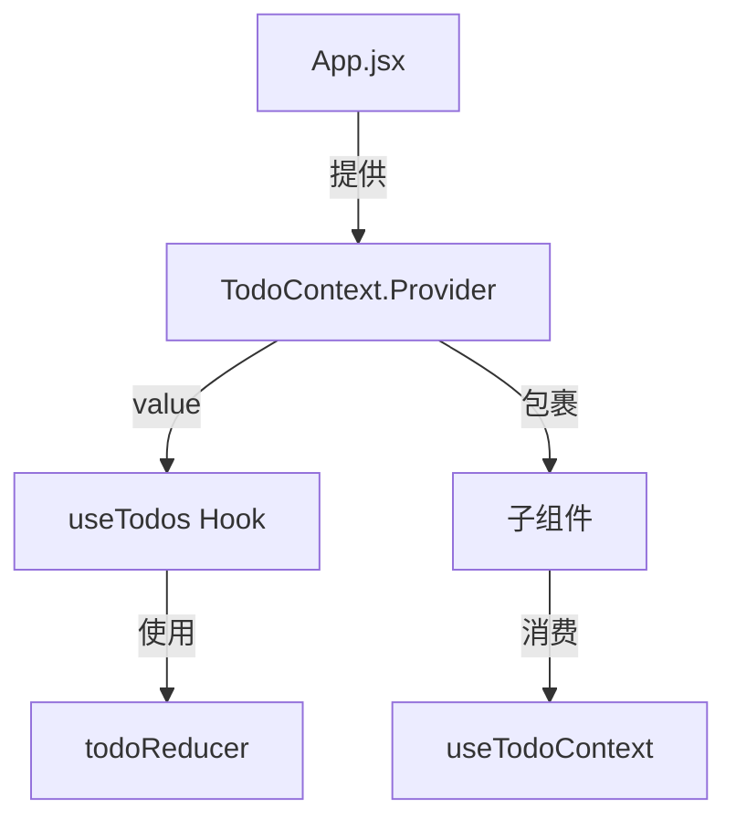

# React useReducer + useContext 状态管理架构解析

## 核心架构图


## 文件结构与功能

### 1. Context创建 (TodoContext.js)
```javascript
import { createContext } from "react";

export const TodoContext = createContext(null); // 创建上下文对象
```

### 2. Reducer逻辑 (todoReducer.js)
```javascript
const todoReducer = function (state, action) {
  switch (action.type) {
    case "ADD_TODO":
      return [...state, { 
        id: Date.now(), 
        text: action.text, 
        done: false 
      }];
    // 其他case...
  }
};
```

### 3. 自定义Hook (useTodos.js)
```javascript
export function useTodos(inital = []) {
  const [todos, dispatch] = useReducer(todoReducer, inital);
  
  const addTodo = (text) => {
    dispatch({ type: "ADD_TODO", text });
  };
  
  return {
    todos,
    addTodo,
    // 其他方法...
  };
}
```

### 4. Context消费Hook (useTodoContext.js)
```javascript
export function useTodoContext() {
  return useContext(TodoContext);
}
```

### 5. Provider设置 (App.jsx)
```javascript
function App() {
  const todosHook = useTodos();
  
  return (
    <TodoContext.Provider value={todosHook}>
      {/* 子组件 */}
    </TodoContext.Provider>
  );
}
```

### 6. 组件消费示例 (AddTodo.jsx)
```javascript
const AddTodo = () => {
  const [text, setText] = useState('');
  const { addTodo } = useTodoContext();
  
  const handleSubmit = (e) => {
    e.preventDefault();
    addTodo(text);
    setText('');
  };
  
  return (
    <form onSubmit={handleSubmit}>
      <input 
        value={text}
        onChange={(e) => setText(e.target.value)} 
      />
      <button type="submit">提交</button>
    </form>
  );
}
```

## 数据流动示意图

1. **初始化流程**
```
App → useTodos → todoReducer → 初始状态 → Context.Provider
```

2. **状态更新流程**
```
UI操作 → 调用context方法 → dispatch action → 
reducer处理 → 返回新状态 → 触发重渲染
```

## 最佳实践建议

1. **代码组织**
- 将reducer拆分为独立文件
- 自定义hook封装业务逻辑
- 创建专用的context消费hook

2. **性能优化**
- 对不变的值使用useMemo
- 复杂组件使用memo优化
- 考虑状态拆分避免不必要的渲染

3. **扩展性**
- 支持中间件模式
- 可组合多个reducer
- 易于添加新action类型
