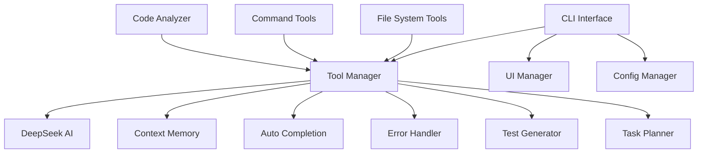

# Mini Claude Code v3 - 开发者文档

## 📖 项目概述

Mini Claude Code v3 是一个功能完整的AI编程助手，展示了现代智能开发工具的复杂性和强大能力。本项目是对 Anthropic Claude Code 的模拟实现，集成了多项前沿技术。

## 🏗️ 架构设计

### 核心组件



### 模块职责

| 模块 | 职责 | 文件位置 |
|------|------|----------|
| **CLI Interface** | 用户交互、命令路由 | `bin/cli-refactored.js` |
| **Tool Manager** | 工具协调、上下文管理 | `lib/tool-manager.js` |
| **UI Manager** | 界面显示、美化输出 | `lib/cli/ui-manager.js` |
| **Command Handler** | 基础命令处理 | `lib/cli/command-handler.js` |
| **AI Command Handler** | AI相关命令处理 | `lib/cli/ai-command-handler.js` |
| **Config Manager** | 配置管理 | `lib/cli/config-manager.js` |
| **DeepSeek AI** | AI服务集成 | `lib/deepseek-ai.js` |
| **Context Memory** | 上下文记忆系统 | `lib/context-memory.js` |
| **Auto Completion** | 智能自动补全 | `lib/auto-completion.js` |
| **Error Handler** | 智能错误处理 | `lib/error-handler.js` |
| **Test Generator** | AI测试生成 | `lib/test-generator.js` |
| **Task Planner** | AI任务规划 | `lib/task-planner.js` |

## 🚀 核心特性

### 1. 流式AI响应
- **实时输出**: 避免长响应超时问题
- **数据块处理**: 支持实时回调和进度显示
- **错误恢复**: 部分响应保护和重试机制

```javascript
// 流式响应示例
await ai.chatStream(message, options, (data) => {
  if (data.content) {
    process.stdout.write(data.content);
  }
});
```

### 2. 上下文记忆系统
- **跨会话记忆**: 持久化对话历史和代码片段
- **智能检索**: 基于相似性和时间的智能搜索
- **用户偏好学习**: 自动学习和应用用户习惯

```javascript
// 记忆系统API
memory.addConversation(userInput, aiResponse, context);
memory.searchCodeSnippets(query, language);
memory.getRelevantHistory(query, maxResults);
```

### 3. 智能自动补全
- **Tab补全**: 命令、文件路径、参数的智能补全
- **上下文感知**: 基于项目状态的智能建议
- **历史浏览**: Up/Down键浏览命令历史

```javascript
// 自动补全配置
const completion = new AutoCompletion(toolManager);
const completions = completion.getCommandCompletions(input);
```

### 4. 智能错误处理
- **多类型错误检测**: 语法、导入、类型、React、ESLint错误
- **AI深度分析**: 根本原因分析和解决方案
- **自动修复**: 常见错误的智能自动修复

```javascript
// 错误处理流程
const analysis = await errorHandler.analyzeError(errorMessage, filePath);
if (analysis.autoFixable) {
  const result = await errorHandler.autoFix(filePath, analysis);
}
```

### 5. AI测试生成
- **智能框架检测**: 自动检测Jest、Mocha、Vitest、Cypress
- **代码结构分析**: 函数、类、导出的深度分析
- **AI测试生成**: 基于代码结构生成高质量测试

```javascript
// 测试生成示例
const testResult = await testGenerator.generateTests(filePath, 'unit');
await fs.writeFile(testResult.testFilePath, testResult.testCode);
```

## 🔧 配置系统

### 配置文件结构

```json
{
  "ai": {
    "timeout": 30000,
    "maxTokens": 2000,
    "temperature": 0.7,
    "streaming": true
  },
  "memory": {
    "maxHistory": 100,
    "maxSnippets": 50,
    "cleanupDays": 30
  },
  "ui": {
    "theme": "auto",
    "showWelcome": true,
    "verbose": false
  },
  "completion": {
    "enabled": true,
    "cacheSize": 1000,
    "showDescriptions": true
  }
}
```

### 环境变量

| 变量名 | 描述 | 默认值 |
|--------|------|--------|
| `DEEPSEEK_API_KEY` | DeepSeek API密钥 | - |
| `MINI_CLAUDE_TIMEOUT` | AI请求超时时间(ms) | 30000 |
| `MINI_CLAUDE_THEME` | UI主题 | auto |
| `MINI_CLAUDE_VERBOSE` | 详细输出模式 | false |
| `MINI_CLAUDE_LOG_LEVEL` | 日志级别 | info |

## 📁 项目结构

```
mini-claude-code-v3/
├── bin/
│   ├── cli.js                    # 原始CLI入口
│   └── cli-refactored.js         # 重构后的CLI入口
├── lib/
│   ├── cli/                      # CLI相关模块
│   │   ├── command-handler.js    # 基础命令处理器
│   │   ├── ai-command-handler.js # AI命令处理器
│   │   ├── ui-manager.js         # UI管理器
│   │   └── config-manager.js     # 配置管理器
│   ├── tool-manager.js           # 工具管理器
│   ├── code-generator.js         # 代码生成器
│   ├── deepseek-ai.js           # DeepSeek AI集成
│   ├── context-memory.js        # 上下文记忆系统
│   ├── auto-completion.js       # 智能自动补全
│   ├── natural-language-processor.js # 自然语言处理
│   ├── error-handler.js         # 智能错误处理
│   ├── test-generator.js        # AI测试生成
│   └── task-planner.js          # AI任务规划
├── tools/
│   ├── filesystem.js            # 文件系统工具
│   ├── command.js               # 命令执行工具
│   └── analyzer.js              # 代码分析器
├── test/                        # 测试文件
├── examples/                    # 示例文件
├── error-test-files/           # 错误测试文件
└── docs/                       # 文档目录
```

## 🔌 API接口

### DeepSeek AI 接口

```javascript
/**
 * 发送聊天消息
 * @param {string|Array} messages - 消息内容或消息数组
 * @param {Object} options - 配置选项
 * @returns {Promise<Object>} 响应结果
 */
async chat(messages, options = {})

/**
 * 流式聊天
 * @param {string|Array} messages - 消息内容
 * @param {Object} options - 配置选项
 * @param {Function} onChunk - 数据块回调函数
 * @returns {Promise<Object>} 响应结果
 */
async chatStream(messages, options = {}, onChunk = null)

/**
 * 生成代码
 * @param {string} description - 代码描述
 * @param {Object} context - 项目上下文
 * @returns {Promise<Object>} 生成结果
 */
async generateCode(description, context = {})

/**
 * 代码审查
 * @param {string} code - 代码内容
 * @param {string} filePath - 文件路径
 * @returns {Promise<Object>} 审查结果
 */
async reviewCode(code, filePath = null)
```

### 工具管理器接口

```javascript
/**
 * 执行工具命令
 * @param {string} toolName - 工具名称
 * @param {string} method - 方法名
 * @param {...any} args - 参数
 * @returns {Promise<Object>} 执行结果
 */
async execute(toolName, method, ...args)

/**
 * 处理自然语言输入
 * @param {string} input - 用户输入
 * @returns {Promise<Object>} 处理结果
 */
async processNaturalLanguage(input)

/**
 * AI聊天（带记忆）
 * @param {string} message - 聊天消息
 * @param {Object} options - 配置选项
 * @returns {Promise<Object>} 聊天结果
 */
async chat(message, options = {})
```

## 🧪 测试

### 运行测试

```bash
# 基础测试
npm test

# 流式响应测试
npm run test:streaming

# 上下文记忆测试
npm run test:memory

# 自动补全测试
npm run test:completion

# 错误处理测试
npm run test:error-handling

# 测试生成测试
npm run test:test-generation

# 任务规划测试
npm run test:task-planning

# 完整功能演示
npm run demo
```

### 测试文件

| 测试文件 | 测试内容 |
|----------|----------|
| `test/test.js` | 基础功能测试 |
| `test/streaming-test.js` | 流式响应测试 |
| `test/context-memory-test.js` | 记忆系统测试 |
| `test/auto-completion-test.js` | 自动补全测试 |
| `test/error-handling-test.js` | 错误处理测试 |
| `test/test-generation-test.js` | 测试生成测试 |
| `test/task-planning-test.js` | 任务规划测试 |
| `test/complete-demo.js` | 完整演示 |

## 🔒 安全考虑

### API密钥管理
- 支持环境变量配置
- 配置文件加密存储（计划中）
- 密钥验证和格式检查

### 命令执行安全
- 输入验证和清理
- 沙箱模式（计划中）
- 危险命令警告

### 数据隐私
- 本地数据存储
- 可选的数据加密
- 用户数据清理功能

## 📈 性能优化

### 缓存策略
- API响应缓存（5分钟TTL）
- 文件系统操作缓存
- 自动补全结果缓存

### 内存管理
- 记忆系统定期清理
- 大文件分块处理
- 对象池重用

### 网络优化
- 请求去重
- 连接池管理
- 超时控制

## 🐛 故障排除

### 常见问题

1. **API密钥错误**
   ```bash
   config set-api-key sk-your-deepseek-api-key
   ```

2. **依赖版本冲突**
   ```bash
   npm install --force
   npm audit fix
   ```

3. **内存不足**
   ```bash
   node --max-old-space-size=4096 bin/cli-refactored.js
   ```

4. **配置重置**
   ```bash
   config reset
   ```

### 调试模式

```bash
# 启用详细输出
MINI_CLAUDE_VERBOSE=true npm start

# 启用调试日志
MINI_CLAUDE_LOG_LEVEL=debug npm start

# 查看配置信息
config show
```

## 🔄 开发指南

### 添加新命令

1. 在 `CommandHandler` 或 `AICommandHandler` 中添加方法
2. 在主CLI的 `_handleCommand` 方法中添加路由
3. 在 `UIManager` 中添加相应的显示方法
4. 更新帮助文档

### 添加新工具

1. 在 `tools/` 目录下创建新工具文件
2. 在 `ToolManager` 中注册工具
3. 实现标准的工具接口
4. 添加相应的测试

### 代码规范

- 使用JSDoc注释
- 遵循ES6+语法
- 错误处理要完整
- 异步操作使用Promise/async-await
- 配置使用ConfigManager统一管理

## 📄 许可证

MIT License - 查看 [LICENSE](LICENSE) 文件了解详情。

## 🤝 贡献指南

1. Fork 项目
2. 创建特性分支 (`git checkout -b feature/AmazingFeature`)
3. 提交更改 (`git commit -m 'Add some AmazingFeature'`)
4. 推送到分支 (`git push origin feature/AmazingFeature`)
5. 开启 Pull Request

## 🙏 致谢

- **DeepSeek AI** - 提供强大的AI能力
- **Anthropic Claude Code** - 灵感来源和目标标杆
- **OpenAI SDK** - API集成支持
- **Node.js 社区** - 优秀的开源生态

---

**Made with ❤️ by Mini Claude Code Team**

> 这个项目展示了现代AI编程助手的真正复杂性和强大能力！