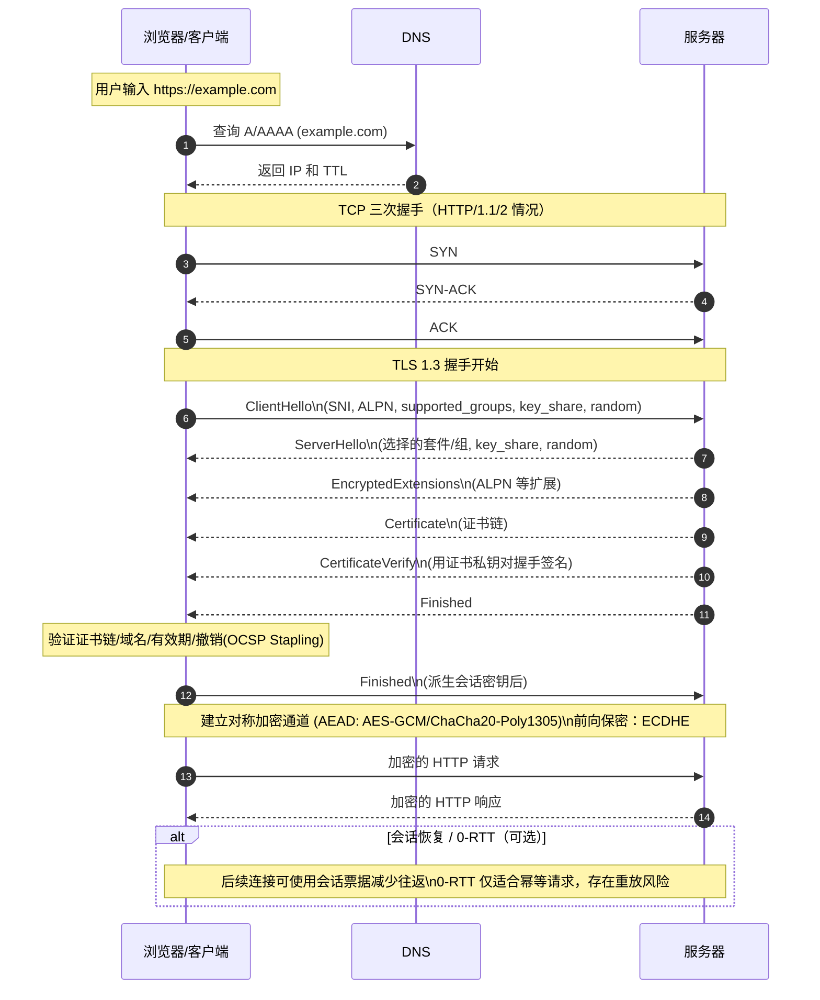
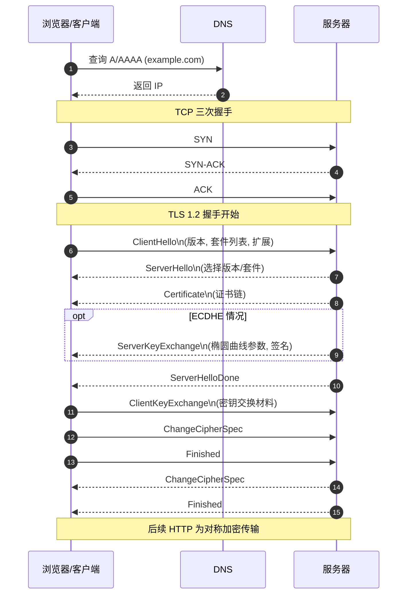

# http & https

- Http 是超文本传输协议，是一种 用于传输超媒体应用层协议

- HTTPS 是 HTTP 的安全版本,多了一层 SSL/TLS 层

- OSI 七层

  - 应用层 GET 提供用户接口 GET /HTTP 还有 websocket 协议 还有 RPC 协议 FTP
  - 表示层
  - 会话层
  - 传输层 TCP/UDP 可靠到达 or 不可靠
  - 网络层 IP 确定目标
  - 数据链路层 MAC 确定源
  - 物理层 物理介质层

  - https 怎么建立的？
  - 中间人攻击
  - 对称加密 非对称加密

    - 私钥 公钥
    - 公钥 任何人都可以拿到
    - 对称加密
    - 非对称加密
    - 权威证书颁发机构
    - 对称加密 放心交出去
    - 以后都是用 对称加密

    - TLS 1.3 比较快

## TLS 1.3 握手与 HTTPS 时序图（含 TCP）

## TLS 1.2 握手与 HTTPS 时序图（对比参考）

## 备注

- SNI/ALPN：在 ClientHello/EncryptedExtensions 中协商域名与 HTTP 版本。
- OCSP Stapling：服务器附带 OCSP 响应，减少在线查询时延。
- HSTS：强制仅走 HTTPS，防降级与中间人引导。
- HTTP/3（QUIC）：基于 UDP，将 TLS 1.3 集成在传输层握手中，时序不同于上述 TCP 流程。
  - 公钥任何浏览
