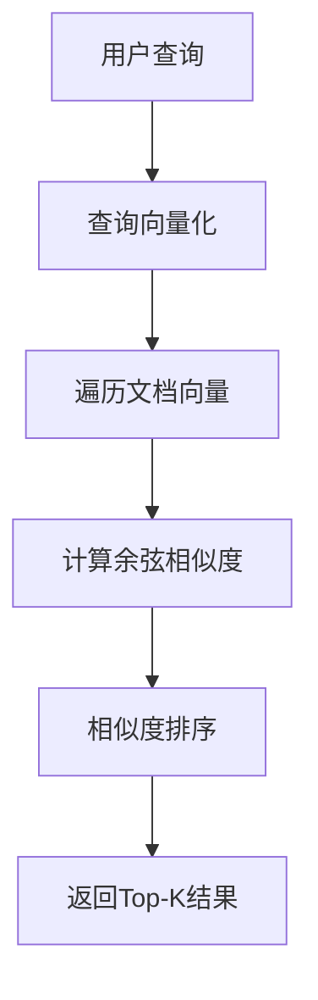

# 语义搜索项目学习笔记

## 项目概述

这是一个基于 OpenAI Embedding API 的语义搜索系统，通过向量化技术实现智能文本检索。项目演示了如何将传统的关键字搜索升级为基于语义理解的搜索系统。

## 核心技术栈

- **Node.js** + **ES Modules**：现代 JavaScript 运行环境
- **OpenAI API**：text-embedding-ada-002 模型（1536 维向量）
- **余弦相似度算法**：向量相似性计算
- **JSON 数据存储**：轻量级数据持久化

## 项目架构分析

### 1. 文件结构

```
semantic-search/
├── main.mjs           # 主搜索逻辑
├── embedding.mjs      # 数据向量化处理
├── llm.mjs           # OpenAI 客户端配置
├── data/
│   ├── post.json     # 原始文章数据
│   └── post-embedding.json  # 向量化后的数据
└── 余弦相似度.md      # 算法原理说明
```

### 2. 核心模块详解

#### llm.mjs - API 配置模块

```javascript
// OpenAI 客户端初始化
export const client = new OpenAI({
  apiKey: process.env.OPENAI_API_KEY,
  baseURL: process.env.OPENAI_BASE_URL,
});

// 余弦相似度计算函数
export const cosineSimilarity = (v1, v2) => {
  const dotProduct = v1.reduce((acc, curr, i) => acc + curr * v2[i], 0);
  const lengthV1 = Math.sqrt(v1.reduce((acc, curr) => acc + curr * curr, 0));
  const lengthV2 = Math.sqrt(v2.reduce((acc, curr) => acc + curr * curr, 0));
  return dotProduct / (lengthV1 * lengthV2);
};
```

**关键知识点：**

- 环境变量配置管理
- 向量数学运算实现
- 模块化导出设计

#### embedding.mjs - 数据预处理模块

```javascript
// 批量向量化处理
for (const { title, category } of posts) {
  const response = await client.embeddings.create({
    model: "text-embedding-ada-002",
    input: `标题：${title} 分类${category}`,
  });
  postsWithEmbedding.push({
    title,
    category,
    embedding: response.data[0].embedding,
  });
}
```

**关键知识点：**

- 批量数据处理模式
- 文本预处理策略（标题+分类组合）
- 异步操作的顺序控制
- 文件 I/O 操作（fs/promises）

#### main.mjs - 搜索引擎核心

```javascript
// 实时搜索流程
const response = await client.embeddings.create({
  model: "text-embedding-ada-002",
  input: `react ,tailwindcss`,
});

const results = posts
  .map((item) => ({
    ...item,
    similarity: cosineSimilarity(embedding, item.embedding),
  }))
  .sort((a, b) => b.similarity - a.similarity)
  .slice(0, 3);
```

**关键知识点：**

- 查询向量化
- 相似度计算与排序
- 结果筛选与格式化
- 函数式编程范式（map-sort-slice 链式操作）

## 技术原理深度解析

### 1. 文本嵌入（Text Embedding）

**概念：** 将文本转换为高维数值向量的技术，使计算机能够理解文本的语义含义。

**text-embedding-ada-002 模型特点：**

- 输出维度：1536 维
- 支持多语言
- 语义理解能力强
- 成本相对较低

**应用场景：**

- 语义搜索
- 文本分类
- 推荐系统
- 问答系统

### 2. 余弦相似度算法

**数学公式：**

```
cos(θ) = (A · B) / (|A| × |B|)
```

**计算步骤：**

1. **点积计算**：`Σ(ai × bi)`
2. **向量长度**：`√(Σ(ai²))`
3. **归一化相除**：消除向量大小影响

**相似度值含义：**

- `1.0`：完全相似（同方向）
- `0.0`：无关联（垂直）
- `-1.0`：完全相反

### 3. 搜索算法流程



## 性能优化策略

### 1. 数据预处理优化

- **离线向量化**：避免实时计算开销
- **批量处理**：减少 API 调用次数
- **数据缓存**：向量结果持久化存储

### 2. 搜索性能优化

- **向量索引**：使用专业向量数据库（如 Pinecone、Weaviate）
- **近似搜索**：LSH（局部敏感哈希）算法
- **并行计算**：多线程相似度计算

### 3. 成本控制

- **输入长度限制**：控制 token 消耗
- **缓存策略**：避免重复向量化
- **批量优化**：合理组织 API 调用

## 实际应用扩展

### 1. 企业级搜索系统

```javascript
// 多字段搜索
const searchInput = `标题：${title} 内容：${content} 标签：${tags.join(",")}`;

// 权重调整
const weightedSimilarity = titleSim * 0.5 + contentSim * 0.3 + tagSim * 0.2;
```

### 2. 推荐系统集成

```javascript
// 用户兴趣向量
const userProfile = calculateUserEmbedding(userHistory);

// 协同过滤 + 内容过滤
const recommendations = combineScores(
  semanticSimilarity,
  collaborativeFiltering
);
```

### 3. 多模态搜索

```javascript
// 图文结合搜索
const multimodalEmbedding = combineEmbeddings(textEmbedding, imageEmbedding);
```

## 技术难点与解决方案

### 1. 冷启动问题

**问题：** 新文档缺乏用户交互数据
**解决：** 基于内容特征的语义匹配

### 2. 语义漂移

**问题：** 上下文变化导致理解偏差
**解决：** 动态更新向量表示，引入时间衰减

### 3. 计算复杂度

**问题：** 大规模数据的实时搜索延迟
**解决：** 分层索引，预计算热门查询

## 最佳实践总结

### 1. 数据质量

- 清洗噪声数据
- 统一文本格式
- 合理的文本分段

### 2. 模型选择

- 根据场景选择合适的嵌入模型
- 考虑多语言支持需求
- 平衡精度与成本

### 3. 系统设计

- 模块化架构设计
- 异步处理优化
- 错误处理机制
- 监控与日志记录

### 4. 用户体验

- 搜索结果多样性
- 实时搜索建议
- 个性化排序
- 搜索结果解释性

## 技术发展趋势

### 1. 模型进化

- 更大参数量的嵌入模型
- 多模态统一表示
- 领域专用模型

### 2. 架构优化

- 向量数据库标准化
- 边缘计算部署
- 联邦学习应用

### 3. 应用创新

- 对话式搜索
- 视觉搜索集成
- 实时个性化推荐

这个项目为理解现代搜索系统提供了完整的技术栈示例，是学习 RAG 系统的重要基础。
