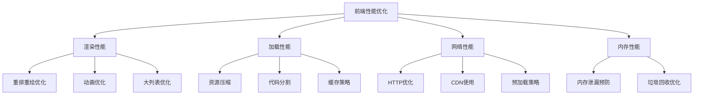

# 前端性能监控和优化

> 🚀 **学习重点**: 掌握性能优化策略，理解性能监控工具使用
>
> ⏱️ **建议复习时间**: 60-90分钟
>
> 🎯 **掌握程度**: 能够独立进行性能分析，制定优化方案

---

## 📑 目录

1. [性能优化概述](#性能优化概述)
2. [渲染性能优化](#渲染性能优化)
3. [加载性能优化](#加载性能优化)
4. [Web Vitals 核心指标](#web-vitals-核心指标)
5. [性能监控工具](#性能监控工具)
6. [React 性能优化](#react-性能优化)
7. [实战案例分析](#实战案例分析)
8. [性能检查清单](#性能检查清单)

---

## 🎯 性能优化概述

### 性能优化的意义

```javascript
// 性能对用户体验的影响
// 1秒延迟 → 转化率下降7%
// 3秒加载 → 53%的用户会离开
// 性能好的网站 → 用户停留时间更长，转化率更高
```

### 性能优化分类



---

## 🎨 渲染性能优化

### 1. 重排与重绘

#### 理解渲染流程

```javascript
// 浏览器渲染流程
// 1. 解析HTML → 构建DOM树
// 2. 解析CSS → 构建CSSOM树
// 3. DOM + CSSOM → 构建渲染树
// 4. 布局（Layout/重排）→ 计算几何信息
// 5. 绘制（Paint/重绘）→ 填充像素
// 6. 合成（Composite）→ 图层合并
```

#### 触发重排的操作

```javascript
// ❌ 以下操作会触发重排
const element = document.getElementById('test');

// 1. 修改元素尺寸
element.style.width = '100px';        // 重排
element.style.height = '100px';       // 重排
element.style.padding = '10px';       // 重排

// 2. 修改元素位置
element.style.left = '50px';          // 重排
element.style.top = '50px';           // 重排

// 3. 获取布局信息（强制同步布局）
const width = element.offsetWidth;    // 重排
const height = element.clientHeight;  // 重排

// 4. 修改DOM结构
document.body.appendChild(element);   // 重排
element.remove();                     // 重排
```

#### 优化策略

```javascript
// ✅ 优化方案1：使用 transform 替代位置属性
// ❌ 不好 - 触发重排
element.style.left = '100px';
element.style.top = '100px';

// ✅ 好 - 只触发合成
element.style.transform = 'translate(100px, 100px)';

// ✅ 优化方案2：批量修改样式
// ❌ 不好 - 多次重排
element.style.width = '100px';
element.style.height = '100px';
element.style.background = 'red';

// ✅ 好 - 一次性修改，减少重排
element.style.cssText = 'width: 100px; height: 100px; background: red';

// ✅ 优化方案3：使用 class 批量修改
// CSS
.highlight {
  width: 100px;
  height: 100px;
  background: red;
  transform: scale(1.1);
}

// JavaScript
element.classList.add('highlight');

// ✅ 优化方案4：使用 DocumentFragment 批量插入
function addManyItems() {
  const fragment = document.createDocumentFragment();

  for (let i = 0; i < 1000; i++) {
    const div = document.createElement('div');
    div.textContent = `Item ${i}`;
    fragment.appendChild(div);
  }

  document.body.appendChild(fragment); // 只触发一次重排
}

// ✅ 优化方案5：缓存布局信息
function animateElement() {
  const element = document.getElementById('animated');
  const width = element.clientWidth;  // 缓存布局信息

  for (let i = 0; i < 100; i++) {
    // 使用缓存的值，避免多次查询
    element.style.transform = `translateX(${width * i / 100}px)`;
  }
}
```

### 2. requestAnimationFrame 优化

```javascript
// ❌ 不好：使用 setTimeout 实现动画
function animateBad() {
  let left = 0;
  const element = document.getElementById('box');

  function move() {
    left += 5;
    element.style.left = left + 'px';

    if (left < 200) {
      setTimeout(move, 16); // 约60fps，但不精确
    }
  }

  move();
}

// ✅ 好：使用 requestAnimationFrame
function animateGood() {
  let left = 0;
  const element = document.getElementById('box');

  function move(timestamp) {
    left += 5;
    element.style.transform = `translateX(${left}px)`;

    if (left < 200) {
      requestAnimationFrame(move); // 与浏览器刷新率同步
    }
  }

  requestAnimationFrame(move);
}

// ✅ 更好：基于时间的动画
function animateBetter() {
  const element = document.getElementById('box');
  const duration = 1000; // 1秒
  const startTime = performance.now();

  function move(currentTime) {
    const elapsed = currentTime - startTime;
    const progress = Math.min(elapsed / duration, 1);

    // 使用缓动函数
    const easeProgress = easeInOutQuad(progress);
    element.style.transform = `translateX(${200 * easeProgress}px)`;

    if (progress < 1) {
      requestAnimationFrame(move);
    }
  }

  requestAnimationFrame(move);
}

function easeInOutQuad(t) {
  return t < 0.5 ? 2 * t * t : -1 + (4 - 2 * t) * t;
}
```

### 3. 虚拟列表优化

```javascript
// 虚拟列表核心实现
class VirtualList {
  constructor(options) {
    this.container = options.container;
    this.itemHeight = options.itemHeight;
    this.data = options.data;
    this.renderItem = options.renderItem;
    this.visibleCount = Math.ceil(this.container.clientHeight / this.itemHeight);
    this.startIndex = 0;
    this.endIndex = this.visibleCount;

    this.init();
  }

  init() {
    // 创建滚动容器
    this.container.style.overflow = 'auto';
    this.container.style.height = '300px';

    // 创建内容容器
    this.content = document.createElement('div');
    this.content.style.height = `${this.data.length * this.itemHeight}px`;
    this.content.style.position = 'relative';
    this.container.appendChild(this.content);

    // 创建可见项容器
    this.visibleItems = document.createElement('div');
    this.visibleItems.style.position = 'absolute';
    this.visibleItems.style.top = '0';
    this.visibleItems.style.width = '100%';
    this.content.appendChild(this.visibleItems);

    // 绑定滚动事件
    this.container.addEventListener('scroll', this.handleScroll.bind(this));

    // 初始渲染
    this.render();
  }

  handleScroll() {
    const scrollTop = this.container.scrollTop;
    const newStartIndex = Math.floor(scrollTop / this.itemHeight);

    if (newStartIndex !== this.startIndex) {
      this.startIndex = newStartIndex;
      this.endIndex = Math.min(
        newStartIndex + this.visibleCount + 1,
        this.data.length
      );
      this.render();
    }
  }

  render() {
    // 清空可见项
    this.visibleItems.innerHTML = '';

    // 渲染可见项
    const fragment = document.createDocumentFragment();

    for (let i = this.startIndex; i < this.endIndex; i++) {
      const item = this.renderItem(this.data[i], i);
      item.style.position = 'absolute';
      item.style.top = `${i * this.itemHeight}px`;
      item.style.height = `${this.itemHeight}px`;
      item.style.width = '100%';
      fragment.appendChild(item);
    }

    this.visibleItems.appendChild(fragment);
  }
}

// 使用示例
const data = Array.from({ length: 10000 }, (_, i) => ({
  id: i,
  text: `Item ${i + 1}`,
  value: Math.random()
}));

const virtualList = new VirtualList({
  container: document.getElementById('list-container'),
  itemHeight: 40,
  data: data,
  renderItem: (item, index) => {
    const div = document.createElement('div');
    div.className = 'list-item';
    div.innerHTML = `
      <span>${item.id + 1}. ${item.text}</span>
      <span>Value: ${item.value.toFixed(2)}</span>
    `;
    return div;
  }
});
```

---

## 📦 加载性能优化

### 1. 代码分割（Code Splitting）

#### 路由级分割

```javascript
// React Router 懒加载
import { lazy, Suspense } from 'react';
import { BrowserRouter as Router, Routes, Route } from 'react-router-dom';

// 懒加载组件
const Home = lazy(() => import('./pages/Home'));
const About = lazy(() => import('./pages/About'));
const Contact = lazy(() => import('./pages/Contact'));

function App() {
  return (
    <Router>
      <Suspense fallback={<div>Loading...</div>}>
        <Routes>
          <Route path="/" element={<Home />} />
          <Route path="/about" element={<About />} />
          <Route path="/contact" element={<Contact />} />
        </Routes>
      </Suspense>
    </Router>
  );
}
```

#### 组件级分割

```javascript
// 动态导入组件
import { useState, lazy, Suspense } from 'react';

const AdminPanel = lazy(() => import('./components/AdminPanel'));
const ChartComponent = lazy(() => import('./components/Chart'));

function Dashboard() {
  const [showAdmin, setShowAdmin] = useState(false);
  const [showChart, setShowChart] = useState(false);

  return (
    <div>
      <h1>Dashboard</h1>

      <button onClick={() => setShowAdmin(!showAdmin)}>
        {showAdmin ? 'Hide' : 'Show'} Admin Panel
      </button>

      <button onClick={() => setShowChart(!showChart)}>
        {showAdmin ? 'Hide' : 'Show'} Chart
      </button>

      {showAdmin && (
        <Suspense fallback={<div>Loading admin panel...</div>}>
          <AdminPanel />
        </Suspense>
      )}

      {showChart && (
        <Suspense fallback={<div>Loading chart...</div>}>
          <ChartComponent />
        </Suspense>
      )}
    </div>
  );
}
```

### 2. 资源预加载策略

```html
<!-- HTML 预加载 -->
<head>
  <!-- 预加载关键资源 -->
  <link rel="preload" href="/fonts/main.woff2" as="font" type="font/woff2" crossorigin>
  <link rel="preload" href="/css/critical.css" as="style">
  <link rel="preload" href="/js/app.js" as="script">

  <!-- 预连接到 CDN -->
  <link rel="preconnect" href="https://cdn.example.com">
  <link rel="dns-prefetch" href="https://api.example.com">

  <!-- 预取下一页资源 -->
  <link rel="prefetch" href="/about.js" as="script">
</head>
```

```javascript
// JavaScript 动态预加载
class ResourceLoader {
  // 预加载脚本
  static preloadScript(url) {
    return new Promise((resolve, reject) => {
      const link = document.createElement('link');
      link.rel = 'preload';
      link.href = url;
      link.as = 'script';
      link.onload = resolve;
      link.onerror = reject;
      document.head.appendChild(link);
    });
  }

  // 预加载图片
  static preloadImage(url) {
    return new Promise((resolve, reject) => {
      const img = new Image();
      img.onload = resolve;
      img.onerror = reject;
      img.src = url;
    });
  }

  // 批量预加载
  static async preloadResources(resources) {
    const promises = resources.map(resource => {
      if (resource.type === 'script') {
        return this.preloadScript(resource.url);
      } else if (resource.type === 'image') {
        return this.preloadImage(resource.url);
      }
    });

    return Promise.all(promises);
  }
}

// 使用示例
// 预加载下一页需要的资源
ResourceLoader.preloadResources([
  { type: 'script', url: '/next-page.js' },
  { type: 'image', url: '/hero-image.jpg' }
]);
```

### 3. 缓存策略

```javascript
// Service Worker 缓存策略
const CACHE_NAME = 'app-v1';
const STATIC_CACHE = 'static-v1';
const DYNAMIC_CACHE = 'dynamic-v1';

// 需要缓存的静态资源
const STATIC_ASSETS = [
  '/',
  '/index.html',
  '/css/main.css',
  '/js/app.js',
  '/fonts/main.woff2'
];

self.addEventListener('install', (event) => {
  event.waitUntil(
    caches.open(STATIC_CACHE)
      .then(cache => cache.addAll(STATIC_ASSETS))
  );
});

self.addEventListener('fetch', (event) => {
  const { request } = event;
  const url = new URL(request.url);

  // 静态资源：缓存优先策略
  if (STATIC_ASSETS.includes(url.pathname)) {
    event.respondWith(
      caches.match(request)
        .then(response => response || fetch(request))
    );
    return;
  }

  // API 请求：网络优先策略
  if (url.origin === self.location.origin && url.pathname.startsWith('/api/')) {
    event.respondWith(
      fetch(request)
        .then(response => {
          // 缓存成功的响应
          if (response.ok) {
            const responseClone = response.clone();
            caches.open(DYNAMIC_CACHE)
              .then(cache => cache.put(request, responseClone));
          }
          return response;
        })
        .catch(() => {
          // 网络失败时返回缓存
          return caches.match(request);
        })
    );
    return;
  }

  // 其他资源：缓存优先，网络更新
  event.respondWith(
    caches.match(request)
      .then(response => {
        if (response) {
          // 异步更新缓存
          fetch(request)
            .then(fetchResponse => {
              if (fetchResponse.ok) {
                caches.open(DYNAMIC_CACHE)
                  .then(cache => cache.put(request, fetchResponse));
              }
            });
          return response;
        }
        return fetch(request);
      })
  );
});
```

---

## 📊 Web Vitals 核心指标

### 1. LCP - 最大内容绘制

```javascript
// LCP 测量和优化
class LCPMonitor {
  constructor() {
    this.observer = null;
    this.lcpEntries = [];
  }

  start() {
    this.observer = new PerformanceObserver((list) => {
      const entries = list.getEntries();
      const lastEntry = entries[entries.length - 1];

      this.lcpEntries.push(lastEntry);
      console.log('LCP:', {
        value: lastEntry.renderTime || lastEntry.loadTime,
        element: lastEntry.element?.tagName,
        url: lastEntry.url
      });
    });

    this.observer.observe({ entryTypes: ['largest-contentful-paint'] });
  }

  stop() {
    if (this.observer) {
      this.observer.disconnect();
    }
  }

  getLatestLCP() {
    return this.lcpEntries[this.lcpEntries.length - 1];
  }
}

// LCP 优化策略
function optimizeLCP() {
  // 1. 预加载关键资源
  const preloadCriticalResources = () => {
    const criticalResources = [
      { url: '/hero-image.jpg', as: 'image' },
      { url: '/main-font.woff2', as: 'font', type: 'font/woff2' }
    ];

    criticalResources.forEach(resource => {
      const link = document.createElement('link');
      link.rel = 'preload';
      link.href = resource.url;
      link.as = resource.as;
      if (resource.type) link.type = resource.type;
      if (resource.as === 'font') link.crossOrigin = 'anonymous';
      document.head.appendChild(link);
    });
  };

  // 2. 移除阻塞渲染的资源
  const removeBlockingResources = () => {
    // 将关键CSS内联到HTML中
    // 非关键CSS异步加载
    const nonCriticalCSS = document.createElement('link');
    nonCriticalCSS.rel = 'preload';
    nonCriticalCSS.href = '/non-critical.css';
    nonCriticalCSS.as = 'style';
    nonCriticalCSS.onload = function() {
      this.onload = null;
      this.rel = 'stylesheet';
    };
    document.head.appendChild(nonCriticalCSS);
  };

  // 3. 优化服务器响应时间
  const optimizeServerResponse = async () => {
    // 使用 CDN
    // 启用 Gzip 压缩
    // 设置合适的缓存头
  };

  preloadCriticalResources();
  removeBlockingResources();
}

// 使用示例
const lcpMonitor = new LCPMonitor();
lcpMonitor.start();
```

### 2. INP - 交互到下一次绘制

```javascript
// INP 测量
class INPMonitor {
  constructor() {
    this.interactionEntries = [];
    this.observer = null;
  }

  start() {
    this.observer = new PerformanceObserver((list) => {
      const entries = list.getEntries();

      entries.forEach(entry => {
        if (entry.interactionId) {
          this.interactionEntries.push({
            duration: entry.processingDuration,
            inputDelay: entry.inputDelay,
            presentationDelay: entry.presentationDelay,
            name: entry.name,
            startTime: entry.startTime,
            target: entry.target
          });
        }
      });

      // 计算第98百分位的INP
      this.calculateINP();
    });

    this.observer.observe({
      entryTypes: ['event', 'first-input']
    });
  }

  calculateINP() {
    if (this.interactionEntries.length < 50) return; // 需要足够的数据

    const sortedEntries = this.interactionEntries
      .sort((a, b) => b.duration - a.duration);

    const inpIndex = Math.floor(sortedEntries.length * 0.98);
    const inp = sortedEntries[inpIndex];

    console.log('INP:', inp.duration);

    if (inp.duration > 200) {
      console.warn('INP 需要优化:', inp);
    }
  }

  stop() {
    if (this.observer) {
      this.observer.disconnect();
    }
  }
}

// INP 优化策略
function optimizeINP() {
  // 1. 分解长任务
  const breakLongTasks = (callback) => {
    const tasks = [];
    let currentTask = [];
    const MAX_TASK_DURATION = 50; // 50ms

    return function(...args) {
      const start = performance.now();

      function executeTask() {
        if (tasks.length === 0) {
          currentTask = [];
          return;
        }

        const task = tasks.shift();
        task();

        const elapsed = performance.now() - start;
        if (elapsed < MAX_TASK_DURATION) {
          requestAnimationFrame(executeTask);
        } else {
          setTimeout(executeTask, 0);
        }
      }

      callback(...args);
      executeTask();
    };
  };

  // 2. 使用 Web Workers
  const useWebWorker = (heavyFunction) => {
    const workerCode = `
      self.onmessage = function(e) {
        const result = (${heavyFunction.toString()})(e.data);
        self.postMessage(result);
      };
    `;

    const blob = new Blob([workerCode], { type: 'application/javascript' });
    const worker = new Worker(URL.createObjectURL(blob));

    return (data) => {
      return new Promise((resolve) => {
        worker.onmessage = (e) => resolve(e.data);
        worker.postMessage(data);
      });
    };
  };

  // 3. 优化事件处理
  const optimizeEventHandling = () => {
    // 使用事件委托
    document.addEventListener('click', (e) => {
      if (e.target.matches('.button')) {
        // 处理按钮点击
      }
    });

    // 使用被动事件监听器
    document.addEventListener('scroll', handleScroll, { passive: true });

    // 防抖高频事件
    const debouncedResize = debounce(handleResize, 100);
    window.addEventListener('resize', debouncedResize);
  };

  function debounce(func, wait) {
    let timeout;
    return function executedFunction(...args) {
      const later = () => {
        clearTimeout(timeout);
        func(...args);
      };
      clearTimeout(timeout);
      timeout = setTimeout(later, wait);
    };
  }
}

// 使用示例
const inpMonitor = new INPMonitor();
inpMonitor.start();
```

### 3. CLS - 累积布局偏移

```javascript
// CLS 测量
class CLSMonitor {
  constructor() {
    this.clsValue = 0;
    this.observer = null;
    this.sessionValue = 0;
    this.sessionEntries = [];
  }

  start() {
    this.observer = new PerformanceObserver((list) => {
      for (const entry of list.getEntries()) {
        // 只计算没有最近用户输入的布局偏移
        if (!entry.hadRecentInput) {
          this.sessionValue += entry.value;
          this.sessionEntries.push(entry);
        }
      }

      // 页面卸载时保存 CLS 值
      if (this.sessionValue > this.clsValue) {
        this.clsValue = this.sessionValue;
        console.log('CLS updated:', this.clsValue);
      }
    });

    this.observer.observe({ entryTypes: ['layout-shift'] });
  }

  stop() {
    if (this.observer) {
      this.observer.disconnect();
    }
  }

  getCLS() {
    return this.clsValue;
  }
}

// CLS 优化策略
function optimizeCLS() {
  // 1. 为图片和视频预留空间
  const reserveSpaceForMedia = () => {
    const images = document.querySelectorAll('img:not([width]):not([height])');

    images.forEach(img => {
      // 如果图片已经加载，获取实际尺寸
      if (img.complete && img.naturalHeight) {
        img.style.aspectRatio = `${img.naturalWidth} / ${img.naturalHeight}`;
      } else {
        // 使用 CSS aspect-ratio 或设置默认比例
        img.style.aspectRatio = '16 / 9';
      }
    });
  };

  // 2. 避免在现有内容上方插入内容
  const avoidInsertingAboveContent = () => {
    // 使用固定位置的横幅
    const banner = document.createElement('div');
    banner.style.position = 'fixed';
    banner.style.top = '0';
    banner.style.width = '100%';
    banner.style.zIndex = '1000';
    // 为body添加padding-top避免内容被遮挡
    document.body.style.paddingTop = banner.offsetHeight + 'px';
  };

  // 3. 使用 transform 动画
  const useTransformAnimations = () => {
    const animatedElements = document.querySelectorAll('[data-animate]');

    animatedElements.forEach(element => {
      element.style.transition = 'transform 0.3s ease';

      // 而不是使用 margin/top/left 属性
      element.addEventListener('mouseenter', () => {
        element.style.transform = 'translateY(-2px)';
      });

      element.addEventListener('mouseleave', () => {
        element.style.transform = 'translateY(0)';
      });
    });
  };

  // 4. 字体加载优化
  const optimizeFontLoading = () => {
    // 使用 font-display: swap
    const style = document.createElement('style');
    style.textContent = `
      @font-face {
        font-family: 'CustomFont';
        src: url('/fonts/custom.woff2') format('woff2');
        font-display: swap;
      }
    `;
    document.head.appendChild(style);

    // 预加载字体
    const fontLink = document.createElement('link');
    fontLink.rel = 'preload';
    fontLink.href = '/fonts/custom.woff2';
    fontLink.as = 'font';
    fontLink.type = 'font/woff2';
    fontLink.crossOrigin = 'anonymous';
    document.head.appendChild(fontLink);
  };

  reserveSpaceForMedia();
  avoidInsertingAboveContent();
  useTransformAnimations();
  optimizeFontLoading();
}

// 使用示例
const clsMonitor = new CLSMonitor();
clsMonitor.start();
```

---

## 🛠️ React 性能优化

### 1. 组件优化

```jsx
// React.memo - 组件记忆化
import React, { memo, useMemo, useCallback } from 'react';

// 普通组件 - 每次父组件更新都会重新渲染
const UserCardBad = ({ user, onUpdate }) => {
  console.log('UserCard 渲染');
  return (
    <div>
      <h3>{user.name}</h3>
      <p>Age: {user.age}</p>
      <button onClick={() => onUpdate(user)}>Update</button>
    </div>
  );
};

// 优化后的组件 - 只在 props 变化时重新渲染
const UserCard = memo(({ user, onUpdate }) => {
  console.log('UserCard 渲染');
  return (
    <div>
      <h3>{user.name}</h3>
      <p>Age: {user.age}</p>
      <button onClick={() => onUpdate(user)}>Update</button>
    </div>
  );
});

// 自定义比较函数
const UserCardWithCustomCompare = memo(({ user, onUpdate }) => {
  return (
    <div>
      <h3>{user.name}</h3>
      <p>Age: {user.age}</p>
      <button onClick={() => onUpdate(user)}>Update</button>
    </div>
  );
}, (prevProps, nextProps) => {
  // 只有当用户ID或名字改变时才重新渲染
  return (
    prevProps.user.id === nextProps.user.id &&
    prevProps.user.name === nextProps.user.name
  );
});
```

### 2. useMemo - 值记忆化

```jsx
// useMemo 使用示例
function ExpensiveComponent({ data, filter }) {
  // ❌ 不好 - 每次渲染都会重新计算
  const filteredDataBad = data
    .filter(item => item.category === filter)
    .sort((a, b) => b.value - a.value)
    .slice(0, 10);

  // ✅ 好 - 只有当 data 或 filter 变化时才重新计算
  const filteredData = useMemo(() => {
    console.log('重新计算过滤数据');
    return data
      .filter(item => item.category === filter)
      .sort((a, b) => b.value - a.value)
      .slice(0, 10);
  }, [data, filter]); // 依赖数组

  // 计算派生状态
  const statistics = useMemo(() => {
    const total = data.reduce((sum, item) => sum + item.value, 0);
    const average = total / data.length;
    const max = Math.max(...data.map(item => item.value));
    const min = Math.min(...data.map(item => item.value));

    return { total, average, max, min };
  }, [data]);

  return (
    <div>
      <h2>统计信息</h2>
      <p>总计: {statistics.total}</p>
      <p>平均: {statistics.average.toFixed(2)}</p>
      <p>最大值: {statistics.max}</p>
      <p>最小值: {statistics.min}</p>

      <h2>过滤结果</h2>
      <ul>
        {filteredData.map(item => (
          <li key={item.id}>
            {item.name}: {item.value}
          </li>
        ))}
      </ul>
    </div>
  );
}
```

### 3. useCallback - 函数记忆化

```jsx
// useCallback 使用示例
function ParentComponent() {
  const [count, setCount] = useState(0);
  const [name, setName] = useState('');

  // ❌ 不好 - 每次渲染都创建新函数
  const handleClickBad = () => {
    console.log('Button clicked');
  };

  // ✅ 好 - 函数被缓存，依赖数组为空
  const handleClick = useCallback(() => {
    console.log('Button clicked');
  }, []); // 空依赖数组

  // ✅ 正确 - 依赖外部状态
  const handleCountIncrement = useCallback(() => {
    setCount(prevCount => prevCount + 1);
  }, []); // 不需要依赖 count，使用函数式更新

  // ✅ 正确 - 依赖外部变量
  const handleLogName = useCallback(() => {
    console.log('Current name:', name);
  }, [name]); // 依赖 name

  // ✅ 复杂逻辑的优化
  const handleAsyncOperation = useCallback(async (id) => {
    try {
      const response = await fetch(`/api/data/${id}`);
      const data = await response.json();
      console.log('Data fetched:', data);
    } catch (error) {
      console.error('Error:', error);
    }
  }, []); // 没有外部依赖

  return (
    <div>
      <ChildComponent
        count={count}
        onIncrement={handleCountIncrement}
        onLogName={handleLogName}
        onAsyncOperation={handleAsyncOperation}
      />
      <input
        value={name}
        onChange={(e) => setName(e.target.value)}
        placeholder="Enter name"
      />
    </div>
  );
}

// 子组件 - 使用 memo 优化
const ChildComponent = memo(({ count, onIncrement, onLogName, onAsyncOperation }) => {
  console.log('ChildComponent 渲染');

  return (
    <div>
      <p>Count: {count}</p>
      <button onClick={onIncrement}>Increment</button>
      <button onClick={onLogName}>Log Name</button>
      <button onClick={() => onAsyncOperation(1)}>Fetch Data</button>
    </div>
  );
});
```

### 4. 列表渲染优化

```jsx
// 虚拟列表 React 实现
import React, { useState, useEffect, useRef, useMemo } from 'react';

const VirtualList = ({
  items,
  itemHeight = 50,
  containerHeight = 400,
  renderItem
}) => {
  const [scrollTop, setScrollTop] = useState(0);
  const containerRef = useRef(null);

  // 计算可见范围
  const visibleRange = useMemo(() => {
    const startIndex = Math.floor(scrollTop / itemHeight);
    const endIndex = Math.min(
      startIndex + Math.ceil(containerHeight / itemHeight) + 1,
      items.length - 1
    );

    return { startIndex, endIndex };
  }, [scrollTop, itemHeight, containerHeight, items.length]);

  // 可见项目
  const visibleItems = useMemo(() => {
    return items.slice(visibleRange.startIndex, visibleRange.endIndex + 1);
  }, [items, visibleRange]);

  const handleScroll = (e) => {
    setScrollTop(e.currentTarget.scrollTop);
  };

  return (
    <div
      ref={containerRef}
      style={{
        height: containerHeight,
        overflow: 'auto',
        border: '1px solid #ccc'
      }}
      onScroll={handleScroll}
    >
      <div style={{ height: items.length * itemHeight, position: 'relative' }}>
        {visibleItems.map((item, index) => {
          const actualIndex = visibleRange.startIndex + index;
          return (
            <div
              key={item.id}
              style={{
                position: 'absolute',
                top: actualIndex * itemHeight,
                height: itemHeight,
                width: '100%',
                boxSizing: 'border-box'
              }}
            >
              {renderItem(item, actualIndex)}
            </div>
          );
        })}
      </div>
    </div>
  );
};

// 使用示例
function BigDataList() {
  const [data] = useState(() =>
    Array.from({ length: 10000 }, (_, i) => ({
      id: i,
      name: `Item ${i + 1}`,
      value: Math.random() * 100,
      category: ['A', 'B', 'C'][i % 3]
    }))
  );

  const renderItem = useCallback((item, index) => {
    return (
      <div style={{
        padding: '10px',
        borderBottom: '1px solid #eee',
        backgroundColor: index % 2 === 0 ? '#f9f9f9' : 'white'
      }}>
        <strong>{item.name}</strong>
        <span style={{ marginLeft: '10px' }}>
          Value: {item.value.toFixed(2)}
        </span>
        <span style={{ marginLeft: '10px', color: '#666' }}>
          Category: {item.category}
        </span>
      </div>
    );
  }, []);

  return (
    <div>
      <h1>虚拟列表示例 (10,000 项)</h1>
      <VirtualList
        items={data}
        itemHeight={60}
        containerHeight={500}
        renderItem={renderItem}
      />
    </div>
  );
}
```

---

## 🔍 性能监控工具

### 1. 性能 API 使用

```javascript
// 完整的性能监控类
class PerformanceMonitor {
  constructor() {
    this.metrics = {};
    this.observers = {};
  }

  // 监控页面加载性能
  measurePageLoad() {
    window.addEventListener('load', () => {
      setTimeout(() => {
        const navigation = performance.getEntriesByType('navigation')[0];

        this.metrics.pageLoad = {
          // DNS 查询时间
          dns: navigation.domainLookupEnd - navigation.domainLookupStart,

          // TCP 连接时间
          tcp: navigation.connectEnd - navigation.connectStart,

          // 请求响应时间
          request: navigation.responseEnd - navigation.requestStart,

          // DOM 解析时间
          domParse: navigation.domContentLoadedEventEnd - navigation.domLoading,

          // 首次内容绘制
          fcp: navigation.responseEnd - navigation.navigationStart,

          // 页面完全加载时间
          loadComplete: navigation.loadEventEnd - navigation.navigationStart
        };

        console.log('页面加载性能:', this.metrics.pageLoad);
        this.reportMetrics();
      }, 0);
    });
  }

  // 监控资源加载性能
  measureResourceLoading() {
    const resources = performance.getEntriesByType('resource');

    this.metrics.resources = resources.map(resource => ({
      name: resource.name,
      type: this.getResourceType(resource.name),
      duration: resource.duration,
      size: resource.transferSize,
      cached: resource.transferSize === 0 && resource.decodedBodySize > 0
    }));

    // 分析资源加载情况
    const slowResources = this.metrics.resources.filter(r => r.duration > 1000);
    if (slowResources.length > 0) {
      console.warn('加载缓慢的资源:', slowResources);
    }
  }

  // 监控用户交互性能
  measureInteractions() {
    const observer = new PerformanceObserver((list) => {
      const entries = list.getEntries();

      entries.forEach(entry => {
        if (entry.name === 'click' || entry.name === 'keydown') {
          console.log('交互延迟:', {
            type: entry.name,
            delay: entry.processingStart - entry.startTime,
            duration: entry.duration
          });
        }
      });
    });

    observer.observe({ entryTypes: ['event'] });
    this.observers.interaction = observer;
  }

  // 监控长任务
  measureLongTasks() {
    if ('PerformanceObserver' in window) {
      const observer = new PerformanceObserver((list) => {
        const entries = list.getEntries();

        entries.forEach(entry => {
          if (entry.duration > 50) {
            console.warn('检测到长任务:', {
              duration: entry.duration,
              startTime: entry.startTime
            });
          }
        });
      });

      try {
        observer.observe({ entryTypes: ['longtask'] });
        this.observers.longTask = observer;
      } catch (e) {
        console.log('浏览器不支持 long task 监控');
      }
    }
  }

  // 监控内存使用
  measureMemoryUsage() {
    if (performance.memory) {
      setInterval(() => {
        this.metrics.memory = {
          used: performance.memory.usedJSHeapSize,
          total: performance.memory.totalJSHeapSize,
          limit: performance.memory.jsHeapSizeLimit
        };

        // 内存使用超过80%时警告
        const usageRatio = this.metrics.memory.used / this.metrics.memory.limit;
        if (usageRatio > 0.8) {
          console.warn('内存使用率过高:', `${(usageRatio * 100).toFixed(1)}%`);
        }
      }, 5000);
    }
  }

  // 监控 Core Web Vitals
  measureCoreWebVitals() {
    // LCP
    new PerformanceObserver((list) => {
      const entries = list.getEntries();
      const lastEntry = entries[entries.length - 1];
      this.metrics.lcp = lastEntry.renderTime || lastEntry.loadTime;
      console.log('LCP:', this.metrics.lcp);
    }).observe({ entryTypes: ['largest-contentful-paint'] });

    // FID
    new PerformanceObserver((list) => {
      const entries = list.getEntries();
      entries.forEach(entry => {
        this.metrics.fid = entry.processingStart - entry.startTime;
        console.log('FID:', this.metrics.fid);
      });
    }).observe({ entryTypes: ['first-input'] });

    // CLS
    let clsValue = 0;
    new PerformanceObserver((list) => {
      const entries = list.getEntries();
      entries.forEach(entry => {
        if (!entry.hadRecentInput) {
          clsValue += entry.value;
        }
      });
      this.metrics.cls = clsValue;
      console.log('CLS:', this.metrics.cls);
    }).observe({ entryTypes: ['layout-shift'] });
  }

  // 上报性能数据
  async reportMetrics() {
    try {
      await fetch('/api/performance', {
        method: 'POST',
        headers: {
          'Content-Type': 'application/json'
        },
        body: JSON.stringify({
          url: window.location.href,
          userAgent: navigator.userAgent,
          timestamp: Date.now(),
          metrics: this.metrics
        })
      });
    } catch (error) {
      console.error('性能数据上报失败:', error);
    }
  }

  // 获取资源类型
  getResourceType(url) {
    if (url.includes('.js')) return 'script';
    if (url.includes('.css')) return 'stylesheet';
    if (url.match(/\.(jpg|jpeg|png|gif|webp|svg)$/i)) return 'image';
    if (url.match(/\.(woff|woff2|ttf|eot)$/i)) return 'font';
    return 'other';
  }

  // 停止所有监控
  stop() {
    Object.values(this.observers).forEach(observer => {
      observer.disconnect();
    });
  }

  // 开始监控
  start() {
    this.measurePageLoad();
    this.measureInteractions();
    this.measureLongTasks();
    this.measureMemoryUsage();
    this.measureCoreWebVitals();

    // 页面卸载时上报数据
    window.addEventListener('beforeunload', () => {
      this.measureResourceLoading();
      this.reportMetrics();
    });
  }
}

// 使用示例
const monitor = new PerformanceMonitor();
monitor.start();
```

### 2. 自定义性能追踪

```javascript
// 自定义性能追踪装饰器
function performanceTrack(target, propertyKey, descriptor) {
  const originalMethod = descriptor.value;

  descriptor.value = function(...args) {
    const start = performance.now();
    const result = originalMethod.apply(this, args);

    if (result instanceof Promise) {
      return result.then(value => {
        const end = performance.now();
        console.log(`${propertyKey} (async) 耗时: ${(end - start).toFixed(2)}ms`);
        return value;
      });
    } else {
      const end = performance.now();
      console.log(`${propertyKey} 耗时: ${(end - start).toFixed(2)}ms`);
      return result;
    }
  };

  return descriptor;
}

// 使用装饰器
class DataService {
  @performanceTrack
  async fetchUsers() {
    const response = await fetch('/api/users');
    return response.json();
  }

  @performanceTrack
  processData(data) {
    return data
      .filter(item => item.active)
      .map(item => ({ ...item, processed: true }))
      .sort((a, b) => a.name.localeCompare(b.name));
  }
}

// 性能追踪函数
function trackPerformance(name, fn) {
  return async function(...args) {
    const start = performance.now();

    try {
      const result = await fn.apply(this, args);
      const end = performance.now();

      console.log(`${name} 成功，耗时: ${(end - start).toFixed(2)}ms`);
      return result;
    } catch (error) {
      const end = performance.now();
      console.error(`${name} 失败，耗时: ${(end - start).toFixed(2)}ms`, error);
      throw error;
    }
  };
}

// 使用示例
const trackedFetchUsers = trackPerformance('获取用户列表', async () => {
  const response = await fetch('/api/users');
  return response.json();
});
```

---

## 📈 实战案例分析

### 案例1：电商平台性能优化

```javascript
// 电商平台性能优化方案
class ECommerceOptimization {
  constructor() {
    this.init();
  }

  init() {
    this.optimizeImages();
    this.optimizeProductList();
    this.optimizeSearch();
    this.optimizeCart();
  }

  // 图片优化
  optimizeImages() {
    // 懒加载图片
    const imageObserver = new IntersectionObserver((entries) => {
      entries.forEach(entry => {
        if (entry.isIntersecting) {
          const img = entry.target;
          const src = img.dataset.src;

          if (src) {
            img.src = src;
            img.classList.remove('lazy');
            imageObserver.unobserve(img);
          }
        }
      });
    });

    document.querySelectorAll('img[data-src]').forEach(img => {
      imageObserver.observe(img);
    });

    // 响应式图片
    this.setupResponsiveImages();
  }

  // 产品列表优化
  optimizeProductList() {
    // 虚拟滚动
    this.setupVirtualScroll();

    // 无限滚动
    this.setupInfiniteScroll();

    // 缓存产品数据
    this.cacheProductData();
  }

  // 搜索优化
  optimizeSearch() {
    let searchTimeout;

    const searchInput = document.getElementById('search');
    if (searchInput) {
      searchInput.addEventListener('input', (e) => {
        clearTimeout(searchTimeout);

        searchTimeout = setTimeout(() => {
          this.performSearch(e.target.value);
        }, 300); // 300ms 防抖
      });
    }

    // 搜索结果缓存
    this.searchCache = new Map();
  }

  // 购物车优化
  optimizeCart() {
    // 使用 Web Workers 处理购物车计算
    this.setupCartWorker();

    // 本地存储购物车状态
    this.persistCartState();
  }

  // 设置响应式图片
  setupResponsiveImages() {
    const pictureElements = document.querySelectorAll('picture[data-responsive]');

    pictureElements.forEach(picture => {
      const width = window.innerWidth;
      const sources = picture.querySelectorAll('source');

      sources.forEach(source => {
        const minWidth = parseInt(source.dataset.minWidth);
        const maxWidth = parseInt(source.dataset.maxWidth);

        if (width >= minWidth && width <= maxWidth) {
          source.media = 'all';
        } else {
          source.media = 'not all';
        }
      });
    });
  }

  // 设置虚拟滚动
  setupVirtualScroll() {
    const container = document.getElementById('product-list');
    if (!container) return;

    const itemHeight = 200;
    const visibleCount = Math.ceil(container.clientHeight / itemHeight) + 2;
    let startIndex = 0;
    let products = [];

    this.virtualScroll = {
      container,
      itemHeight,
      visibleCount,
      startIndex,
      render: () => {
        const endIndex = Math.min(startIndex + visibleCount, products.length);
        const fragment = document.createDocumentFragment();

        for (let i = startIndex; i < endIndex; i++) {
          const product = products[i];
          const element = this.createProductElement(product, i);
          fragment.appendChild(element);
        }

        container.innerHTML = '';
        container.appendChild(fragment);
      }
    };
  }

  // 创建产品元素
  createProductElement(product, index) {
    const div = document.createElement('div');
    div.className = 'product-item';
    div.style.position = 'absolute';
    div.style.top = `${index * this.virtualScroll.itemHeight}px`;
    div.style.height = `${this.virtualScroll.itemHeight}px`;
    div.innerHTML = `
      
      <h3>${product.name}</h3>
      <p>¥${product.price}</p>
      <button onclick="addToCart(${product.id})">加入购物车</button>
    `;
    return div;
  }
}

// 性能监控集成
const ecommerceMonitor = new PerformanceMonitor();
ecommerceMonitor.start();

// 应用优化
const optimization = new ECommerceOptimization();
```

---

## ✅ 性能检查清单

### 渲染性能 ✅

- [ ] **重排优化**
  - [ ] 使用 `transform` 替代 `left/top/position`
  - [ ] 使用 `opacity` 替代 `visibility`
  - [ ] 批量修改 DOM 样式
  - [ ] 使用 `DocumentFragment` 批量插入
  - [ ] 缓存布局计算结果

- [ ] **动画优化**
  - [ ] 使用 `requestAnimationFrame`
  - [ ] 避免使用 `setTimeout/setInterval` 做动画
  - [ ] 使用 CSS `transform` 和 `opacity`
  - [ ] 避免昂贵的 CSS 属性

- [ ] **大列表优化**
  - [ ] 实现虚拟滚动
  - [ ] 使用 `React.memo` 优化列表项
  - [ ] 避免 `index` 作为 `key`
  - [ ] 分页或无限滚动

### 加载性能 ✅

- [ ] **资源优化**
  - [ ] 图片压缩和格式优化 (WebP)
  - [ ] 开启 Gzip/Brotli 压缩
  - [ ] 移除未使用的 CSS/JS
  - [ ] 合并小文件，拆分大文件

- [ ] **代码分割**
  - [ ] 路由级别的懒加载
  - [ ] 组件级别的懒加载
  - [ ] 第三方库分离
  - [ ] 使用动态 `import()`

- [ ] **缓存策略**
  - [ ] 设置合适的 `Cache-Control`
  - [ ] 使用 `ETag` 和 `Last-Modified`
  - [ ] 实现 Service Worker
  - [ ] 利用浏览器缓存

### Web Vitals ✅

- [ ] **LCP (< 2.5s)**
  - [ ] 预加载关键资源
  - [ ] 优化服务器响应时间
  - [ ] 使用 CDN
  - [ ] 内联关键 CSS

- [ ] **INP (< 200ms)**
  - [ ] 分解长任务
  - [ ] 使用 Web Workers
  - [ ] 优化事件处理
  - [ ] 使用被动事件监听器

- [ ] **CLS (< 0.1)**
  - [ ] 为图片指定宽高
  - [ ] 预留字体空间
  - [ ] 避免顶部插入内容
  - [ ] 使用 `transform` 动画

### React 优化 ✅

- [ ] **组件优化**
  - [ ] 使用 `React.memo`
  - [ ] 合理使用 `useMemo`
  - [ ] 正确使用 `useCallback`
  - [ ] 避免 props 深度比较

- [ ] **状态管理**
  - [ ] 避免不必要的状态提升
  - [ ] 使用 `useReducer` 管理复杂状态
  - [ ] 合理拆分组件
  - [ ] 避免在渲染中创建对象

### 监控工具 ✅

- [ ] **性能测量**
  - [ ] 集成 Lighthouse CI
  - [ ] 使用 Performance API
  - [ ] 监控 Core Web Vitals
  - [ ] 设置性能预算

- [ ] **错误监控**
  - [ ] 全局错误捕获
  - [ ] 性能异常上报
  - [ ] 用户行为追踪
  - [ ] 实时性能告警

---

## 🎯 总结

### 核心优化策略

1. **减少重排重绘**
   - 使用 CSS `transform` 和 `opacity`
   - 批量 DOM 操作
   - 缓存布局信息

2. **优化资源加载**
   - 代码分割和懒加载
   - 预加载关键资源
   - 合理的缓存策略

3. **提升交互性能**
   - 分解长任务
   - 使用 Web Workers
   - 优化事件处理

4. **监控和测量**
   - 使用 Performance API
   - 监控 Core Web Vitals
   - 建立性能基线

### 性能优化的黄金法则

- 🎯 **测量优先**: 先测量，后优化
- 🎯 **用户体验**: 关注真实用户感受
- 🎯 **持续监控**: 性能是持续的过程
- 🎯 **渐进增强**: 从关键路径开始优化

---

**📚 扩展阅读**:
- [Web.dev Performance](https://web.dev/performance/)
- [MDN Performance API](https://developer.mozilla.org/en-US/docs/Web/API/Performance)

**⏰ 更新时间**: 2025-10-26