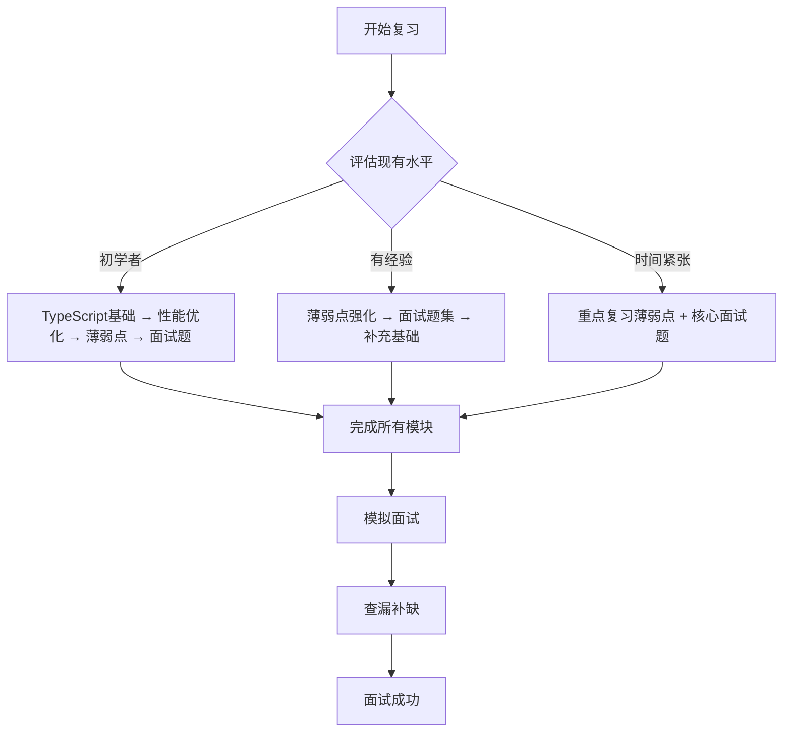

# 前端面试复习文档

> 🎯 **目标**: 系统化复习前端核心知识，提升面试竞争力
>
> 📅 **创建日期**: 2025-10-26
>
> 📚 **文档结构**: 涵盖 TypeScript、性能优化、薄弱点强化、面试题库四大模块

---

## 📖 文档概览

本复习文档针对今天的学习任务精心整理，包含以下四个核心模块：

| 模块 | 文档 | 重点内容 | 预估用时 |
|------|------|----------|----------|
| 🔰 | [01-TypeScript基础.md](./01-TypeScript基础.md) | 接口、泛型、高级类型、实战应用 | 45-60分钟 |
| ⚡ | [02-前端性能优化.md](./02-前端性能优化.md) | 渲染优化、加载优化、Web Vitals、React优化 | 60-90分钟 |
| 🎯 | [03-薄弱点复习.md](./03-薄弱点复习.md) | Call/Apply/Bind、原型链、this指向、手写实现 | 45-60分钟 |
| 💼 | [04-面试问题集.md](./04-面试问题集.md) | JS基础、TS进阶、React框架、算法题、场景题 | 90-120分钟 |

**总复习时间**: 4-5小时

---

## 🚀 快速开始

### 第一次复习流程

1. **评估现状** (10分钟)
   - 快速浏览各模块目录
   - 评估自己对每个主题的熟悉程度
   - 标记出需要重点复习的内容

2. **系统学习** (3-4小时)
   - 按模块顺序深入复习
   - 动手实践代码示例
   - 完成每个模块的练习题

3. **强化练习** (30分钟)
   - 重点练习薄弱环节
   - 完成面试题集中的编程题
   - 模拟面试场景

4. **总结巩固** (20分钟)
   - 回顾重要概念
   - 整理学习笔记
   - 制定后续学习计划

### 个性化学习路径



---

## 📚 模块详解

### 1. TypeScript 基础 ([查看详情](./01-TypeScript基础.md))

#### 🎯 学习目标
- 熟练掌握接口和泛型的使用
- 理解 TypeScript 类型系统的核心概念
- 能够在实际项目中应用 TypeScript 最佳实践

#### 📋 内容大纲
- **基础类型**：类型注解、类型别名、联合类型
- **接口**：定义、继承、实现、索引签名
- **泛型**：泛型函数、泛型接口、泛型类、约束
- **高级类型**：条件类型、映射类型、工具类型
- **实战应用**：Vue3 + TypeScript、React + TypeScript

#### 💡 学习建议
- 重点理解泛型的设计思想和使用场景
- 通过实际代码练习接口的定义和使用
- 掌握常用工具类型的应用
- 结合框架学习 TypeScript 的实际应用

### 2. 前端性能优化 ([查看详情](./02-前端性能优化.md))

#### 🎯 学习目标
- 理解性能优化的核心指标和方法
- 掌握渲染性能和加载性能的优化技巧
- 熟练使用性能监控工具和 Web Vitals

#### 📋 内容大纲
- **渲染性能**：重排重绘、requestAnimationFrame、虚拟列表
- **加载性能**：代码分割、懒加载、缓存策略、预加载
- **Web Vitals**：LCP、INP、CLS 的测量和优化
- **React 优化**：memo、useMemo、useCallback、虚拟滚动
- **监控工具**：Performance API、自定义监控、性能分析

#### 💡 学习建议
- 理解性能优化的原理，而不是死记硬背
- 重点掌握 Web Vitals 核心指标
- 通过实际项目练习性能优化技巧
- 学会使用浏览器开发工具进行性能分析

### 3. 薄弱点复习 ([查看详情](./03-薄弱点复习.md))

#### 🎯 学习目标
- 彻底理解 Call/Apply/Bind 的原理和应用
- 掌握原型链和继承的各种实现方式
- 熟练手写常用的 JavaScript API

#### 📋 内容大纲
- **Call/Apply/Bind**：原理、实现、高级应用
- **原型链与继承**：原型机制、继承方式、ES6 Class
- **this 指向**：绑定规则、优先级、常见陷阱
- **手写实现**：Promise、防抖节流、深拷贝、EventEmitter
- **常见错误**：this 丢失、类型错误、绑定问题

#### 💡 学习建议
- 重点理解 this 的绑定规则和优先级
- 通过手写实现加深对原理的理解
- 总结常见的错误模式和解决方案
- 多做练习，形成肌肉记忆

### 4. 面试问题集 ([查看详情](./04-面试问题集.md))

#### 🎯 学习目标
- 掌握前端面试的常见问题和标准答案
- 能够独立解决算法和数据结构问题
- 具备场景应用题的分析和解决能力

#### 📋 内容大纲
- **JavaScript 基础**：数据类型、作用域、闭包、异步编程
- **TypeScript 进阶**：类型系统、泛型、高级类型
- **React 框架**：Hooks、状态管理、性能优化
- **性能优化**：渲染优化、虚拟滚动、懒加载
- **CSS 与布局**：Flexbox、Grid、响应式设计
- **算法与数据结构**：数组操作、字符串处理、常见算法
- **场景应用**：图片懒加载、文本编辑器、状态管理

#### 💡 学习建议
- 不要死记硬背答案，理解原理更重要
- 重点练习算法题，提高编码能力
- 准备项目经验，能够详细介绍技术选型
- 模拟面试场景，提高表达能力

---

## 🎯 复习策略

### 高效复习方法

#### 1. 主动学习法
```markdown
✅ 阅读 → 理解 → 实践 → 总结
❌ 只看不练 → 被动接受 → 容易遗忘
```

#### 2. 费曼学习法
- 选择一个概念
- 用简单的语言解释给别人听
- 发现理解不足的地方
- 回到资料中补充学习

#### 3. 间隔重复法
- 第1天：学习新知识
- 第3天：复习第一天内容
- 第7天：重点复习薄弱点
- 第14天：全面回顾

### 重点难点攻克

#### TypeScript 难点
- [ ] 泛型约束和条件类型
- [ ] 映射类型和工具类型
- [ ] 高级类型推断

#### 性能优化难点
- [ ] Web Vitals 的具体优化策略
- [ ] React 性能优化的最佳实践
- [ ] 性能监控和分析方法

#### JavaScript 难点
- [ ] this 绑定的优先级
- [ ] 原型链的底层机制
- [ ] 异步编程的进阶应用

---

## 📝 学习记录

### 复习进度追踪

| 日期 | TypeScript | 性能优化 | 薄弱点 | 面试题 | 完成度 | 备注 |
|------|------------|----------|--------|--------|--------|------|
| 2025-10-26 | ✅ | ✅ | ✅ | ✅ | 100% | 完成初次复习 |
| | | | | | | |
| | | | | | | |

### 错题记录

```markdown
## 错题本

### 题目：[描述题目]
**错误答案**: [记录错误答案]
**正确答案**: [记录正确答案]
**知识点**: [涉及的知识点]
**复习次数**: [记录复习次数]
```

---

## 🛠️ 开发环境配置

### 代码练习环境

```bash
# 创建练习项目
mkdir frontend-interview-practice
cd frontend-interview-practice

# 初始化项目
npm init -y

# 安装依赖
npm install typescript @types/node
npm install react react-dom typescript
npm install -D vite @vitejs/plugin-react

# 配置文件已准备在 assets 目录中
```

### 推荐工具

- **编辑器**: VS Code + 相关插件
- **浏览器**: Chrome (开发者工具)
- **在线练习**: CodeSandbox, StackBlitz
- **版本控制**: Git

---

## 📊 学习评估

### 自测题目

#### TypeScript 基础测试
1. 解释 interface 和 type 的区别
2. 什么是泛型约束？请举例说明
3. 如何实现一个类型安全的深度只读？

#### 性能优化测试
1. 什么是 Web Vitals？包含哪些核心指标？
2. 如何优化 LCP（最大内容绘制）？
3. React.memo、useMemo、useCallback 的区别和使用场景？

#### JavaScript 测试
1. 实现 call、apply、bind 方法
2. 解释 this 的绑定规则和优先级
3. 手写一个 Promise 实现

### 评分标准

| 等级 | 分数范围 | 评价标准 |
|------|----------|----------|
| 🌟 初级 | 0-60分 | 基础概念掌握不足，需要系统学习 |
| 🌟🌟 中级 | 61-80分 | 基础扎实，能够解决常见问题 |
| 🌟🌟🌟 高级 | 81-95分 | 深入理解原理，能够解决复杂问题 |
| 🌟🌟🌟🌟 专家 | 96-100分 | 全面掌握，能够进行架构设计 |

---

## 🎯 面试准备清单

### 技术准备 ✅

- [ ] **JavaScript 核心**
  - [ ] 数据类型和类型转换
  - [ ] 作用域和闭包
  - [ ] this 指向和绑定规则
  - [ ] 原型链和继承
  - [ ] 异步编程和事件循环

- [ ] **TypeScript 进阶**
  - [ ] 类型系统和类型推导
  - [ ] 接口和泛型的使用
  - [ ] 高级类型和工具类型
  - [ ] 装饰器和元编程

- [ ] **React 框架**
  - [ ] Hooks 的原理和使用
  - [ ] 状态管理方案
  - [ ] 性能优化技巧
  - [ ] 组件设计模式

- [ ] **性能优化**
  - [ ] Web Vitals 指标
  - [ ] 渲染性能优化
  - [ ] 加载性能优化
  - [ ] 性能监控和分析

### 项目准备 ✅

- [ ] **项目介绍**
  - [ ] 项目背景和目标
  - [ ] 技术栈选择理由
  - [ ] 个人职责和贡献

- [ ] **技术难点**
  - [ ] 遇到的挑战
  - [ ] 解决方案和思路
  - [ ] 最终效果和反思

### 软技能准备 ✅

- [ ] **沟通表达**
  - [ ] STAR 方法回答问题
  - [ ] 主动提问和互动
  - [ ] 清晰表达技术方案

- [ ] **问题解决**
  - [ ] 分析问题的能力
  - [ ] 提出多种解决方案
  - [ ] 评估方案优劣

---

## 📞 技术支持

### 学习资源

- **官方文档**: [MDN](https://developer.mozilla.org/)、[TypeScript](https://www.typescriptlang.org/)
- **在线教程**: [React 官网](https://react.dev/)、[Web.dev](https://web.dev/)
- **练习平台**: [LeetCode](https://leetcode.cn/)、[CodeWars](https://www.codewars.com/)

### 联系方式

如果在学习过程中遇到问题，建议：

1. **查阅官方文档** - 获取最准确的信息
2. **搜索技术社区** - Stack Overflow、掘金、思否
3. **实践验证** - 通过代码验证理论
4. **总结笔记** - 形成自己的知识体系

---

## 🚀 持续更新

### 版本记录

| 版本 | 日期 | 更新内容 |
|------|------|----------|
| v1.0 | 2025-10-26 | 初始版本，包含四个核心模块 |

### 后续计划

- [ ] 增加更多实战案例
- [ ] 补充高级算法题
- [ ] 添加 Vue 相关内容
- [ ] 完善项目经验指导

---

## 🎉 开始学习

准备好开始你的前端面试复习之旅了吗？

**建议的学习路径：**

1. 📖 先通读 README，了解整体结构
2. 🎯 根据自身情况选择重点模块
3. 💻 动手实践每个代码示例
4. 📝 完成所有练习题
5. 🔄 定期复习和巩固

**记住：** 学习是一个持续的过程，保持耐心和坚持，你一定能够成功！

---

**📚 祝你学习愉快，面试成功！** 🚀

---

*最后更新: 2025-10-26 | 文档版本: v1.0*